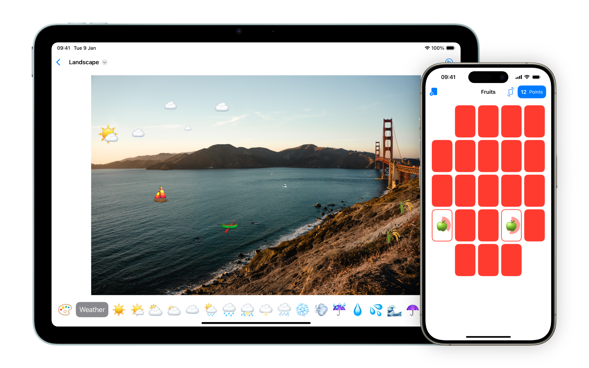

  
  <h1>CS193p</h1>
  

    Projects created for the online version of Stanford's CS193p - Developing Apps for iOS course for 2023
  

---

## Overview

This repository contains my implementations of the core projects from Stanford's CS193p course, demonstrating progressive learning of iOS development concepts and SwiftUI patterns.

## Projects

### 🃏 Memorize!
A card-matching memory game that explores:
- SwiftUI fundamentals and declarative UI
- MVVM architecture patterns
- State management and data flow
- Custom animations and transitions

https://github.com/user-attachments/assets/91298108-4b12-4d71-81d9-8c8cff650220

### 🎨 EmojiArt
A creative drawing app featuring:
- Document-based app architecture
- Drag and drop functionality
- Complex gesture handling
- Integration with system frameworks

## Key Learning Outcomes

- **SwiftUI Learning**: Built proficiency in declarative UI development
- **Architecture**: Implemented MVVM patterns for scalable app design
- **State Management**: Understood @State, @ObservableObject, and data flow
- **iOS Fundamentals**: Explored view lifecycle, navigation, and system integration
- **Best Practices**: Applied clean code principles and iOS design guidelines

---
*Self-directed learning completed as part of continuous iOS development education*
You can view more about this project at [cs193p.stanford.edu/2023](https://cs193p.stanford.edu/2023)
